# 🎵 Dynamic Island Spotify Controller

A sleek, macOS-style Dynamic Island widget for Windows that displays your currently playing Spotify track with smooth animations and playback controls.


## ✨ Features

- 🎨 **Dynamic Color Theming** - UI colors adapt to your album artwork
- 🔄 **Smooth Animations** - GPU-accelerated Qt6 animations
- 🎛️ **Full Playback Control** - Play, pause, skip, repeat, and volume
- 📊 **Progress Bar** - Seek through tracks with visual progress
- 🖥️ **Minimal Footprint** - Collapses to a small pill when not in use
- ⚡ **Fast Loading** - Optimized image caching for instant response

---

## 🚀 Quick Start (3 Steps)

```mermaid
graph LR
    A[📥 Download ZIP] --> B[⚙️ Run setup.bat]
    B --> C[▶️ Run run.bat]
    C --> D[🎉 Enjoy!]
    
    style A fill:#1DB954,stroke:#333,stroke-width:2px,color:#fff
    style B fill:#1DB954,stroke:#333,stroke-width:2px,color:#fff
    style C fill:#1DB954,stroke:#333,stroke-width:2px,color:#fff
    style D fill:#FFD700,stroke:#333,stroke-width:2px,color:#333
```



### Step 1: Download 📥

**Option A: Download ZIP (Easiest)**
1. Click [📦 Download ZIP](https://github.com/HyPosei/dynamic-island-spotify/archive/refs/heads/main.zip)
2. Extract the ZIP file
3. Open the extracted folder

**Option B: Clone with Git**
```bash
git clone https://github.com/HyPosei/dynamic-island-spotify.git
cd dynamic-island-spotify
```

### Step 2: Setup ⚙️

**Double-click `setup.bat`** - it will automatically:
- ✅ Check Python installation
- ✅ Create virtual environment
- ✅ Install all dependencies
- ✅ Guide you through Spotify API setup
- ✅ Create `.env` configuration file

> 💡 **First time setup takes 2-3 minutes.** The script will guide you through each step!

### Step 3: Run ▶️

**Double-click `run.bat`** and you're done!

> 💡 **On first run**, your browser will open asking for Spotify permission. Click "Accept" and the app will start automatically!

---

## 🔑 Spotify API Setup (Detailed Guide)

The setup script will guide you, but here's what happens:


### Detailed Steps:

1. **Open Spotify Developer Dashboard**
   - The setup script will automatically open: https://developer.spotify.com/dashboard
   - Login with your Spotify account (free or premium, but premium required to use the app)

2. **Create New Application**
   - Click "**Create App**" button
   - Fill in the form:
     - **App name**: `Dynamic Island` (or any name you want)
     - **App description**: `Spotify controller for Windows`
     - **Redirect URI**: `http://localhost:8888/callback` ⚠️ **IMPORTANT: Must be exact!**
     - **API**: Check "**Web API**"
   - Accept terms and click "**Save**"

3. **Get Your Credentials**
   - Click on your newly created app
   - Click "**Settings**" button
   - You'll see:
     - **Client ID** - Copy this (it's visible)
     - **Client Secret** - Click "**View client secret**" then copy

4. **Enter in Setup Script**
   - Paste **Client ID** when prompted
   - Paste **Client Secret** when prompted
   - Done! The script saves these to `.env` automatically

> [!IMPORTANT]
> **Keep your Client Secret private!** Never share it or commit the `.env` file to Git.

---

## 📋 Requirements

- **Windows 10/11**
- **Python 3.10 or higher**
- **Spotify Premium account** (required for playback control API)

> 💡 Don't have Python? The setup script will detect this and guide you to download it!

---

## 🎮 How to Use

| Action | How |
|--------|-----|
| **Expand Widget** | Hover your mouse over the island |
| **Play/Pause** | Click the ▶️/⏸️ button |
| **Next Track** | Click ⏭️ |
| **Previous Track** | Click ⏮️ |
| **Adjust Volume** | Use the volume slider or mouse scroll wheel |
| **Seek Track** | Drag the progress bar |
| **Toggle Repeat** | Click the 🔁 button |
| **Open in Spotify** | Click the album artwork |
| **Exit App** | Right-click tray icon → Exit |

---

## 🛠️ Troubleshooting

### ❌ "Python not found"
**Problem**: Setup script can't find Python.

**Solutions**:
1. Install Python 3.10+ from https://www.python.org/downloads/
2. ⚠️ **During installation, check "Add Python to PATH"**
3. Restart your computer
4. Run `setup.bat` again

### ❌ "API authentication failed"
**Problem**: Can't connect to Spotify API.

**Solutions**:
1. Verify your **Client ID** and **Client Secret** are correct
2. Check that Redirect URI is exactly: `http://localhost:8888/callback`
3. Make sure you accepted the Spotify permission request in your browser
4. Delete `.env` and `.spotify_cache` files, then run `setup.bat` again

### ❌ "Port 8888 already in use"
**Problem**: Another app is using port 8888.

**Solutions**:
1. Close other applications that might use this port
2. Or edit `.env` file and change the redirect URI to use a different port (e.g., `http://localhost:8889/callback`)
3. **Important**: Also update this in your Spotify Dashboard app settings!

### ❌ "No module named 'PySide6'"
**Problem**: Dependencies not installed properly.

**Solutions**:
1. Delete the `venv` folder
2. Run `setup.bat` again
3. If it still fails, manually run:
   ```bash
   python -m venv venv
   venv\Scripts\activate
   pip install -r requirements.txt
   ```

### ❌ "Restriction violated" error
**Problem**: Trying to control playback without Spotify Premium.

**Solutions**:
- Spotify API requires a **Premium account** for playback control
- The app will still display what's playing, but controls won't work without Premium

### ❌ Widget not appearing
**Problem**: App runs but widget doesn't show.

**Solutions**:
1. Check if Spotify is running and playing music
2. Look for the app icon in the system tray (bottom-right corner)
3. Right-click the tray icon → make sure it's not minimized
4. Check Windows display scaling settings (works best at 100-150%)

### ❌ "Access denied" or permission errors
**Problem**: Windows blocking file creation.

**Solutions**:
1. Run the folder/script as Administrator (right-click → "Run as administrator")
2. Check your antivirus isn't blocking Python or the script
3. Move the project folder to a location where you have full permissions (e.g., Documents)

---

## 🎨 Customization

Want to tweak the appearance? Edit the `Config` and `Colors` classes in [`dynamic_island.py`](file:///c:/Users/ismail/OneDrive/Desktop/projelerim/spoti/dynamic_island.py):

```python
class Config:
    COLLAPSED_W, COLLAPSED_H = 200, 52  # Size when minimized
    EXPANDED_W, EXPANDED_H = 440, 150   # Size when expanded
    ANIMATION_MS = 350                   # Animation duration (milliseconds)
    POLL_INTERVAL = 1000                 # Update frequency (milliseconds)

class Colors:
    PRIMARY = "#1DB954"    # Spotify green (accent color)
    CARD = "#1a1a1a"       # Background color
    TEXT = "#FFFFFF"       # Text color
```

---

## 📦 Building Standalone EXE

Want to create a portable executable that doesn't require Python installation?

### 1. Build the EXE
```bash
build_exe.bat
```
This takes a few minutes and creates the executable in the `dist` folder.

### 2. What Gets Created
In the `dist` folder you'll find:
- `DynamicIslandSpotify.exe` - The main application
- Supporting files (automatically included)

### 3. First Run
When you run the EXE for the first time:
1. It will ask for your Spotify API credentials (same as setup process)
2. Creates `.env` and `.spotify_cache` files
3. Opens browser for Spotify authentication

### 4. Distribution
To share with others:
- Copy the entire `dist` folder
- They'll need to set up their own Spotify API credentials
- No Python installation required!

> [!NOTE]
> The EXE file is quite large (~100MB) because it includes Python and all dependencies.

---

## 📖 Manual Installation

If you prefer manual setup instead of using the automated scripts:

```bash
# 1. Create virtual environment
python -m venv venv

# 2. Activate virtual environment
venv\Scripts\activate

# 3. Install dependencies
pip install -r requirements.txt

# 4. Create .env file
copy .env.example .env

# 5. Edit .env file with your Spotify API credentials
notepad .env

# 6. Run the application
python dynamic_island.py
```

---

## 🤝 Contributing

Contributions are welcome! Here's how you can help:

1. 🐛 **Report bugs** - Open an issue with details
2. 💡 **Suggest features** - Share your ideas
3. 🔧 **Submit PRs** - Fork, code, and create a pull request
4. 📖 **Improve docs** - Help make the README even better

---

## 📄 License

This project is licensed under the MIT License - see the [`LICENSE`](LICENSE) file for details.

---

## 🙏 Acknowledgments

- Inspired by **Apple's Dynamic Island**
- Built with [**PySide6**](https://wiki.qt.io/Qt_for_Python) (Qt6 for Python)
- [**Spotipy**](https://spotipy.readthedocs.io/) for Spotify API integration
- [**Pillow**](https://python-pillow.org/) for image processing
- [**ColorThief**](https://github.com/fengsp/color-thief-py) for dynamic color extraction

---

## ⚖️ Disclaimer

> [!WARNING]
> This project is **not affiliated with, endorsed by, or sponsored by Spotify AB or Apple Inc.**

- "**Spotify**" is a registered trademark of **Spotify AB**
- "**Dynamic Island**" is a trademark of **Apple Inc.**
- This is an independent, open-source project created for **educational and personal use only**
- This project does **not** bypass any Spotify Premium restrictions or violate Spotify's Terms of Service
- All Spotify API usage complies with [Spotify Developer Terms of Service](https://developer.spotify.com/terms/)

**Use at your own risk.** The author(s) are not responsible for any issues arising from the use of this software.

---

<div align="center">

**Made with ❤️ for music lovers**

If you like this project, give it a ⭐ on GitHub!

</div>
